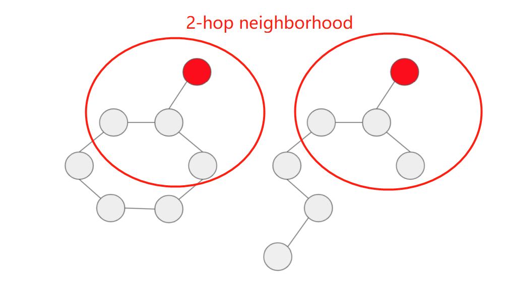
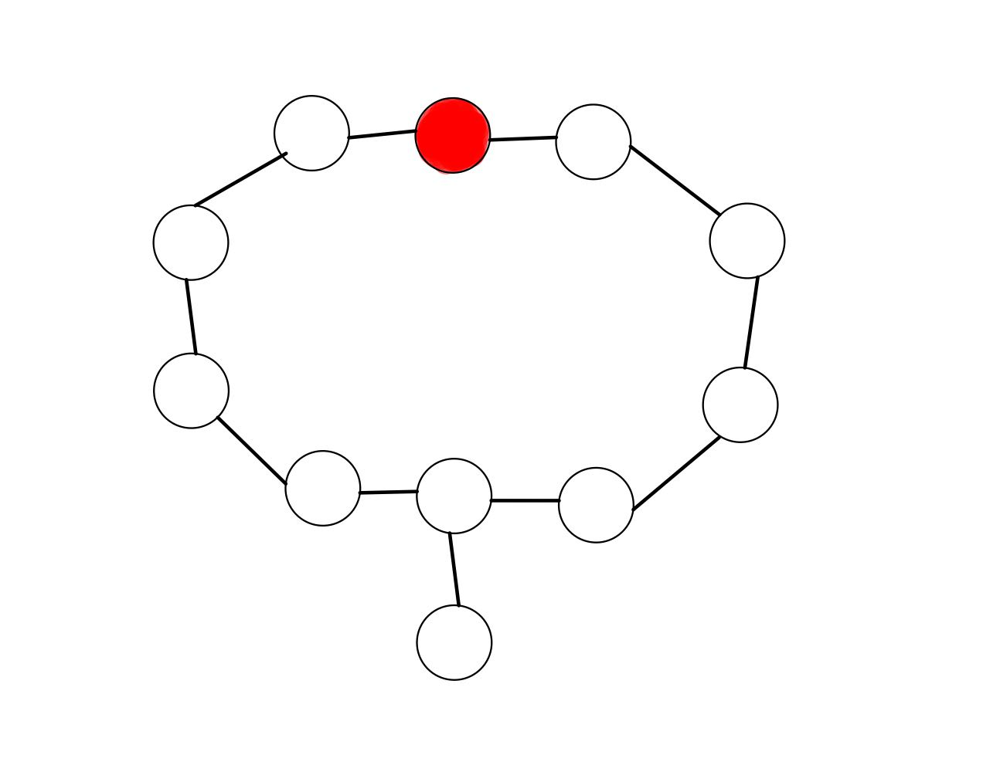
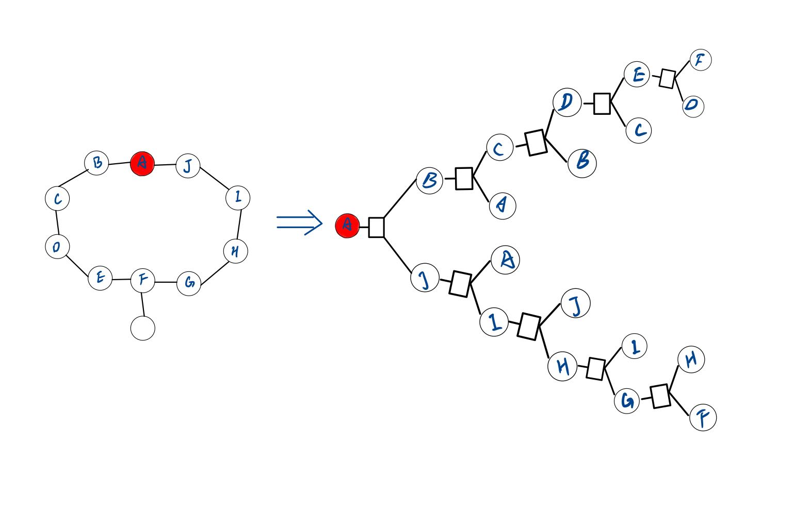

# **COMP5214 Assignment Part 2 Report**
## 2.1 **Effect of Depth on Expressiveness**
1. From the two graphs we can see that the 1-hop neighborhood of the two red nodes are identical, the 2-hop neighborhood of the red nodes are also identical. Only when we consider up to the 3-hop neighborhood will we obtain a structrual difference. **Therefore a minimum of 3 message passing is needed to distinguish the two red nodes.**

2. An example of a graph where the red node should be classified as True is shown as follows:

To perfectly perform this classification task, it's obvious that we need to include the 10 nodes in the induced cyclic subgraph in our network. Therefore, we need at least 5 layers to include all 10 nodes. As shown in the following graph:

## 2.2 **Relation to Random Walk**
1. The transition matrix P can be expressed using the adjacency matrix A and degree matrix D as:
$$
    \begin{matrix}
    P
    \end{matrix} = 
    \begin{pmatrix}
    \begin{matrix}
    A
    \end{matrix}
    \begin{matrix}
    D
    \end{matrix}^{-1}
    \end{pmatrix}^T=
    \begin{pmatrix}
    \begin{matrix}
    D
    \end{matrix}^{-1}
    \end{pmatrix}^T
    \begin{matrix}
    A
    \end{matrix}^T
$$
As D is a diagonal matrix and A is a symmetric matrix, so 
$$A^T = A, D^T = D, (D^{-1})^T = D^{-1}$$
So P can also be expressed as 
$$ P = D^{-1}A$$

2. In this case, the transistion matrix P' is: 
$$P'= \dfrac{1}{2}P+\dfrac{1}{2}I =\dfrac{1}{2}(I+D^{-1}A)$$

## 2.3 **Learning BFS with GNN**
1. 
$$
h_v^{(t)}=min(1,h_v^{(t-1)}+\sum_{u\epsilon N(v)}h_u)
$$
2. 
    Message function can be an identity function:
    $$ MSG(v) = v$$
    Aggregation function can be a clamped sum:
    $$ AGG(v) = min(1, \sum_{u\epsilon N(v)}u)