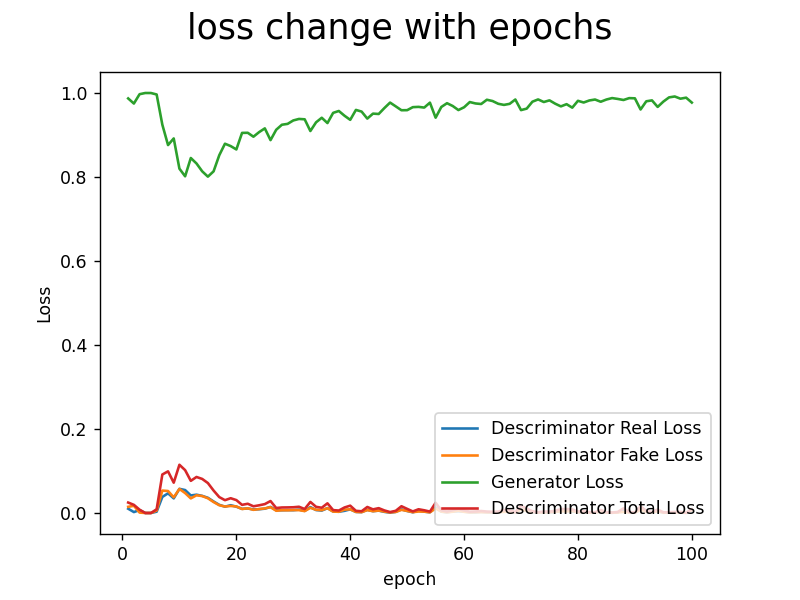
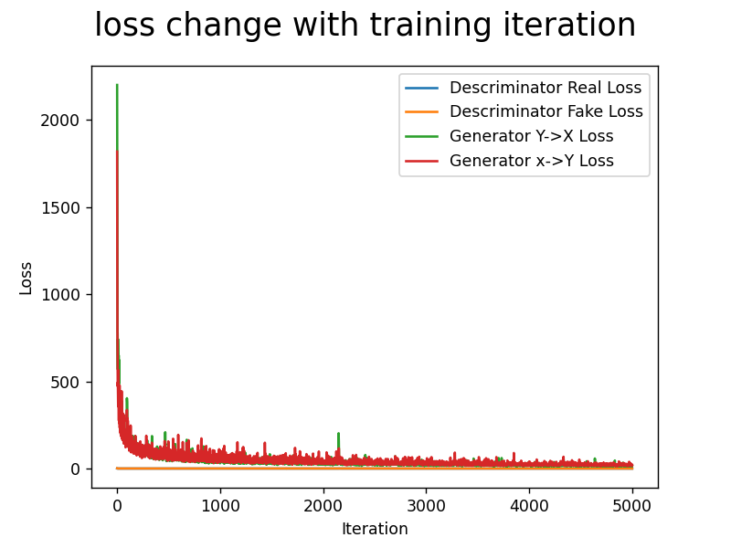

# **COMP5214 Assignment3 Report**

## **DCGAN**

**The DCGAN was trained with a `learing_rate` of 0.01, `batch_size` of 16, for a total of 100 epochs.**

* **The training loss graph of DCGAN is as follows:**

DCGAN Loss change with epochs

* **Here are some sample images generated by the DCGAN:**

| 1st epoch                              | 20th epoch                             | 40th epoch                             | 60th epoch                             | 80th epoch                             | 100th epoch                            |
| :------------------------------------- | :------------------------------------- | :------------------------------------- | :------------------------------------- | :------------------------------------- | :------------------------------------- |
|  |  |  |  |  |  |

**We can see that the countours of the pictures becomes clear approximately after the 20th epoch**

## **CycleGAN**

**The DCGAN was trained with a `learing_rate` of 0.01, `batch_size` of 16, for a total of 5000 iterations.**

* **The training loss graph of DCGAN is as follows:**

CycleGAN Loss change with iterations

* **Here are some sample images generated by the CycleGAN:**

|                | X->Y                                        | Y->X                                        |
| :------------- | :------------------------------------------ | :------------------------------------------ |
| 1000 iteration |  |  |
| 2000 iteration |  |  |
| 3000 iteration |  |  |
| 4000 iteration |  |  |
| 5000 iteration |  |  |

**We can see that the results are already very good after the forst 1000 iterations**

## **Side Notes (Modification to the skelton that is not a part of "FILL IN")**

* **latest `scipy` version no longer support `imsave()`, it was replaced by `imwrite()` from `imageio`**
* **the `if` statement for `device` choosing was reversed, it was designed to choose `cuda` when `torch.cuda.is_available()` returns `False`, which doesn't make sense**
* **the model creation in the `create_model()` function for both DCGAN and CycleGAN does not match the `__init()__` function of the corresponding classes. I have modified the function call to make them fit.**
